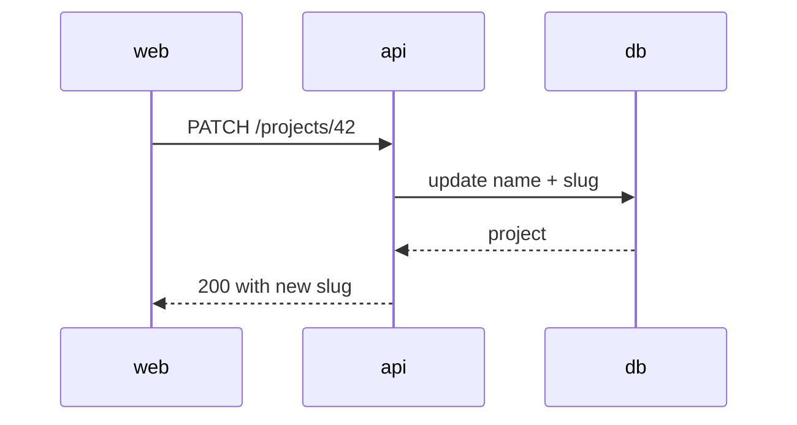

# Writing PR Descriptions

A reviewer opens a PR knowing nothing and reads the description to decide where to
look. Everything they can get by clicking Files Changed is wasted words. The
description's whole job is the part the diff can't tell them: why, what shape it
has, and what to distrust.

## Before writing a word

1. **Read the template.** `.github/pull_request_template.md` (either case), or the
   files under `.github/PULL_REQUEST_TEMPLATE/`. Check; don't assume there is none.
   Keep every section it defines, in order. A section that truly doesn't apply gets
   one line saying so, never a silent deletion.
2. **Read the diff**, not just your memory of writing it — `git diff main...HEAD
--stat`, then the substantive files.
3. **List the facts a reviewer needs.** Then assign each one a medium from the table
   below _before_ drafting. Whatever is left over after that assignment is the prose,
   and it is usually a third of what you expected to write.

Facts, not sections, are the unit. A single fact lands in one section only.

## Pick the medium

| The fact is…                                                | Medium                                                            |
| ----------------------------------------------------------- | ----------------------------------------------------------------- |
| a payload, response, or config shape                        | fenced `json`/`yaml` — a minimal constructed example              |
| a type or class relationship                                | mermaid `classDiagram`, or three lines of ASCII if that's clearer |
| a request crossing 2+ services, or async/ordered steps      | mermaid `sequenceDiagram`                                         |
| branching logic, a pipeline with a fork, a retry path       | mermaid `flowchart`                                               |
| a status/lifecycle field and its transitions                | mermaid `stateDiagram-v2`                                         |
| table or entity relationships                               | mermaid `erDiagram`                                               |
| a changed call site                                         | before/after, two short blocks                                    |
| verification                                                | the command, and its real output                                  |
| a fixed value set, or behavior per case                     | markdown table                                                    |
| the why, the tradeoff, the scope boundary, what to distrust | prose                                                             |

Nothing outside that last row is prose. "The request schema splits off from the
stored record, which extends it" is a shape described in words — three ASCII lines beat
it and are shorter.

## Code blocks are constructed, not copied

The failure mode is pasting the diff back at the reviewer. It looks like effort and
carries nothing.

- **Never copy from the diff.** If a reviewer gets the same information from Files
  Changed, delete the block.
- A block shows the change **from outside**: the wire payload a client now receives,
  the call shape a caller now writes, the command and what it printed.
- **≤10 lines.** Elide with `…`. Needing more means it's the wrong artifact.
- No imports, no boilerplate, no full function bodies, **no test bodies**. Name the
  test file and say what it pins; don't paste it.
- One block per fact. Two blocks showing the same thing at different zoom levels is
  one block.

Bad — lifted from the diff, and the reviewer has already seen it:

```ts
export async function renameProject(id: string, name: string): Promise<Project> {
  const project = await projects.get(id);
  assertCanRename(project, name);
  return projects.update(id, { name, slug: toSlug(name) });
}
```

Good — constructed, and answers a question the diff doesn't:

```text
PATCH /projects/42 { "name": "Q3 Roadmap" }
→ 200 { "id": "42", "name": "Q3 Roadmap", "slug": "q3-roadmap" }
```

## Mermaid

GitHub renders a fenced `mermaid` block natively. Reach for one when the change has
a shape prose flattens: an ordering, a fan-out, a cycle, a state machine, three or
more participants.

Skip it for two nodes and one arrow — that's a sentence. Skip it for a picture of
the file tree. Skip it when three lines of ASCII say the same thing, since ASCII
diffs legibly on a later edit and a diagram doesn't.

Keep the syntax boring: you cannot preview it before posting, and a syntax error
renders as a raw error box in the description. No `classDef`, no styling, no themes,
no nested subgraphs. Node ids stay alphanumeric; punctuation lives inside a quoted
label. ≤8 nodes. Label edges with the verb.

````markdown

````

## The delete pass

Before posting, one pass. Each item is a cut, not a rewrite:

- A fact stated in two sections → keep the better home, delete the other.
- A sentence defending a decision nobody challenged → one clause, or gone. Search
  your draft for _deliberately_, _worth noting_, _worth stating_, _to be clear_,
  _it's important to_. Each hit is a paragraph arguing with an imaginary reviewer.
- Process narrative — earlier drafts, review rounds, what this laptop couldn't run →
  gone, unless a reviewer must act on it. Then one line.
- A block copied from the diff → replace with a constructed artifact, or delete.
- Prose describing a shape → convert to the medium above.
- Every sentence that doesn't change what the reviewer does or decides → gone.

Then: checkboxes unchecked unless Michael verified that item this session. A falsely
checked box is a lie to the reviewer; an unchecked one is his job.

## Budgets

~80 words of prose per template section, blocks and diagrams free. Absent a template,
~250 words total. Exceed a budget for ordered migration steps, an exact repro, or a
decision with real alternatives to weigh — not for symmetry, not to seem thorough.

## Footer

Every posted PR description carries the LLM-attribution footer, once, at the end,
in place of the harness's "Generated with Claude Code" line:

```markdown
🤖 **LLM-generated**
```

Include it in drafts shown for approval, so what Michael approves is what gets
posted. Removing it is his call alone. Never ask whether to add it.

## Delegating

A subagent inherits none of this. Write the body yourself and hand off only the
`gh pr create` / `gh pr edit` step. Never let a subagent invent its own section
layout or "improve" the wording.
